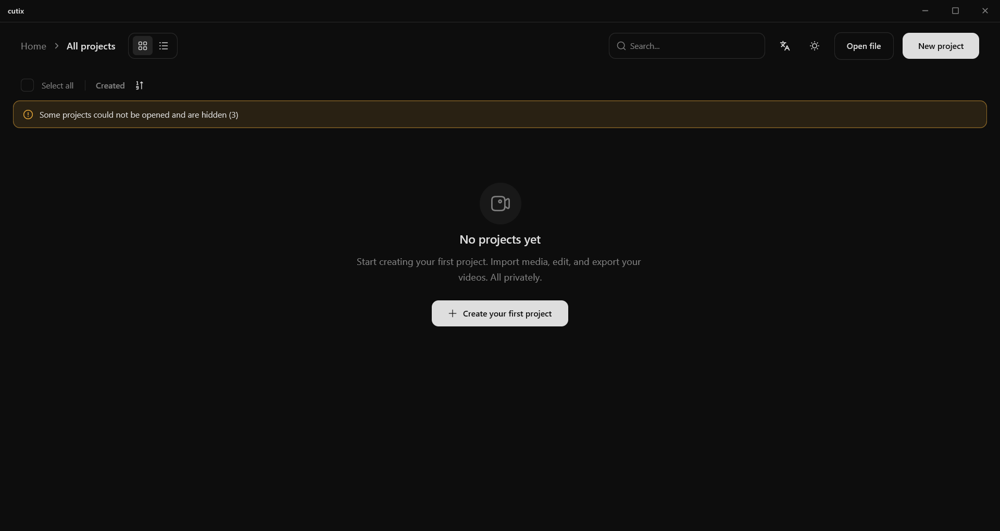
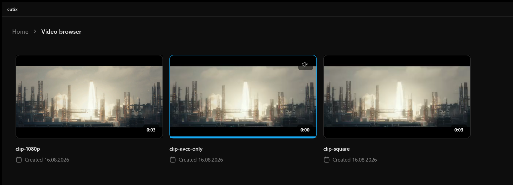
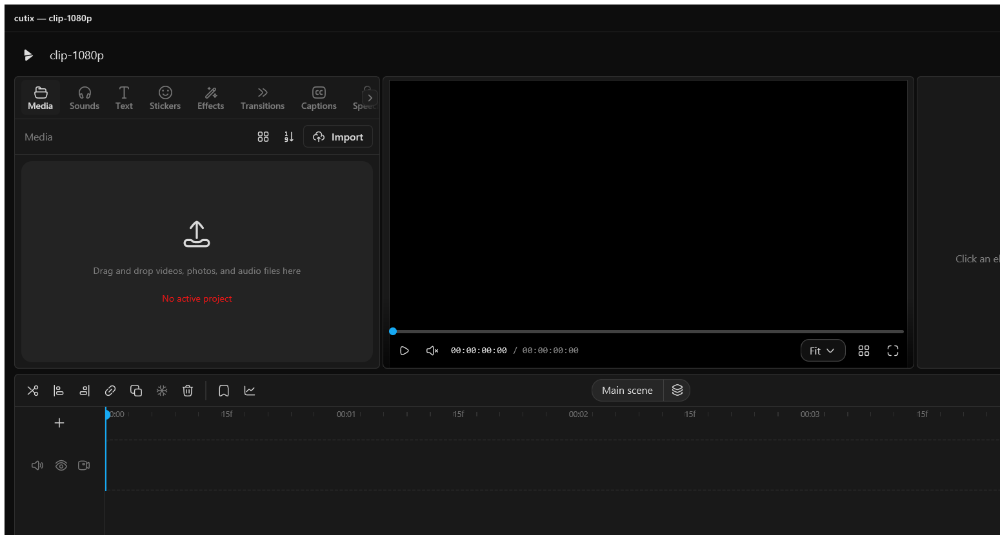

<div align="center">


# cutix

**A video editor that runs on your own machine.**
No cloud, no subscription, nothing of yours uploaded anywhere.



</div>

---

## Install

Grab the archive for your system — Windows, Linux or NixOS — unpack it and run it. There is nothing
to install: it is a single file next to the `lang` folder.

Current versions are on the [releases page](https://github.com/xpepelok/cutix/releases).

On first run the editor adds itself to the Explorer context menu and to "Open with". You can undo
that at any time:

```bash
cutix --unregister-file-types
```

If you would rather build it yourself, see [Building](#building) at the bottom.

---



## Straight from the file manager

Right-click a video and it is already in work — no need to open the editor first:

- **Edit in cutix** — the file opens as a ready project
- **Publish** — the YouTube upload window and nothing else
- **Open in cutix** on a folder — every clip in it as a gallery
- cutix shows up under "Open with" for video and audio

## Video browser

Every clip on your machine in one gallery. Hover a card and the preview plays right there, with a
scrub bar along the bottom. From here you can watch it full size, send it to the editor, or put it
on YouTube.

## Publishing to YouTube

Uploads happen inside the app: title, description, tags, category, visibility, thumbnail, schedule.
Clips upload asynchronously, and when one finishes Windows shows a notification — click it and the
video link is on your clipboard. If you have added more than one account, you pick which one
publishes.

## Editing



Multi-track timeline, cutting, trimming, ripple insert, snapping to neighbours, markers, scenes,
full undo. Cropping with ready aspect ratios, speed changes with smooth ramps, freeze frames,
**clip reverse**, slow motion with frame blending.

## Picture

- **Colour correction** — brightness, contrast, exposure, saturation, temperature, shadows and
  highlights, sharpness
- **Curves and HSL** — per-channel work and eight hue ranges
- **Filters** — ready looks with a strength dial, plus your own `.cube` tables
- **Background removal** — neural, with a per-frame mode for moving subjects
- **Chroma key**, retouch, mosaic, background blur in one click
- **Masks** — rectangle, ellipse, star, heart, film bars, with feathering
- **Stabilisation** and **auto-reframe** — the frame follows the subject
- **Object tracking** — a caption or sticker rides along with whatever you marked
- Keyframes on everything, with a curve editor

## Transitions and motion

Dissolve, fade through black, slides and wipes in four directions, zoom — the audio at the seam is
blended along with the picture. Push in, pull out, pans, the Ken Burns effect, drift for photos,
pulse, shake: every preset lands as ordinary keyframes you can adjust by hand afterwards.

## Sound

- **Music library** — search across freely licensed tracks with attribution
- **Beat detection** — markers on the timeline in time with the music
- **Noise removal** and **loudness levelling** for voice
- **Equaliser**, reverb, voice changing that keeps the timbre
- Fades, and silence trimmed out in one click

## Text and subtitles

Twelve ready styles, in and out animations, typewriter. **Automatic subtitles** through speech
recognition, `.srt` import and export, one style applied to every cue. **Speech synthesis** — text
read aloud.

## Templates

Save any project of yours as a template and build the next clips from it. Separately, there is
**CapCut draft import** — with all the clips, timings and your own files.

## Export

MP4 and WebM at four quality levels. Ready sizes for YouTube, vertical, square and 4:5 — several
formats can go out in a single pass. Your own watermark: image or text, nine positions, rotation,
blend modes, tiling, shown over a stretch of time, saved as presets.

## Languages

Fifteen: English, Russian, Ukrainian, German, Polish, Belarusian, Kazakh, Swedish, Norwegian,
Danish, Italian, French, Turkish, Arabic and Hebrew. Switched in settings, applied immediately.

Adding your own is easy: drop a file into `lang/`, name the language inside it, and it appears in
the list. Untranslated strings fall back to English.

## Updates

The app checks for a new version and shows what changed and how big the download is. An update is
installed **only after you agree to it**.

---

## Building

Works on Windows, Linux and NixOS.

You need [Rust](https://rustup.rs); on Windows the MSVC build tools, on Linux `alsa`, `fontconfig`,
`libxkbcommon` and the X11/Wayland headers.

```bash
git clone https://github.com/xpepelok/cutix
cd cutix
cargo build -p cutix --release
```

The binary is `target/release/cutix`.

On NixOS the flake already describes everything:

```bash
nix build .#default     # build
nix develop             # development shell
```

```bash
cargo test --workspace                                  # 1527 tests
cargo run -p cutix --release -- --register-file-types   # file manager entries
```

Releases are cut from the version in `apps/native/Cargo.toml`: raise it, push to `main`, and GitHub
Actions builds all three systems and publishes them with that tag.

---

## Licence

MIT — [xpepelok](https://github.com/xpepelok), 2026.
